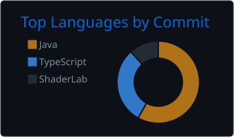

  

---

## Sobre mim

Sou estudante de **Ciência da Computação na UNISAGRADO** e desenvolvedor
**Full-Stack**, com experiência na construção de APIs, interfaces web,
integrações e soluções orientadas a dados.

- Desenvolvimento com **Java, Python, TypeScript, JavaScript e C#**
- Interesse em **arquitetura de software, código limpo e sistemas escaláveis**
- Foco em transformar problemas reais em produtos funcionais e bem estruturados

## Stack principal

<table>
  <tr>
    <td width="50%" align="center" valign="top">
      <h3>Back-End</h3>
      
      
APIs, regras de negócio, integrações e serviços.

    </td>

    <td width="50%" align="center" valign="top">
      <h3>Front-End</h3>
      
      
Interfaces responsivas, componentização e experiência do usuário.

    </td>
  </tr>

  <tr>
    <td width="50%" align="center" valign="top">
      <h3>Dados & Serviços</h3>
      
      
Modelagem, persistência e serviços em nuvem.

    </td>

    <td width="50%" align="center" valign="top">
      <h3>DevOps & Workflow</h3>
      
      
Ambientes reproduzíveis, versionamento e automação.

    </td>
  </tr>
</table>

## Projetos em destaque

### [DocuAI](https://github.com/JoaoMatheusVerissimo/docuai)

SaaS multi-tenant para análise inteligente de documentos, com autenticação
JWT, workspaces, controle de acesso baseado em funções e arquitetura preparada
para processamento assíncrono e RAG com citações.

`React` `TypeScript` `Spring Boot` `FastAPI` `MySQL`

[Ver repositório](https://github.com/JoaoMatheusVerissimo/docuai)

---

### [NutriAI](https://github.com/JoaoMatheusVerissimo/NutriAI)

Aplicação que utiliza inteligência artificial para oferecer recursos
relacionados a nutrição e alimentação.

`TypeScript` `Inteligência Artificial`

[Ver repositório](https://github.com/JoaoMatheusVerissimo/NutriAI)

---

### [Caminhos de Madre](https://github.com/JoaoMatheusVerissimo/CaminhosDeMadreC)

Jogo desenvolvido como projeto final, reunindo lógica de programação,
experiência visual e implementação de shaders.

`ShaderLab` `Game Development`

[Ver repositório](https://github.com/JoaoMatheusVerissimo/CaminhosDeMadreC)

## Vamos conversar

Estou aberto a conexões, colaboração em projetos e oportunidades de
desenvolvimento Full-Stack.

  
  

## GitHub em números

  
  

 

  
    Projetando interfaces claras, construindo serviços sólidos e conectando as duas pontas.
  

