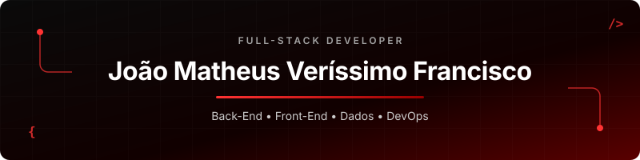
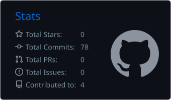

  

 

  <strong>Construo aplicações completas, da regra de negócio à experiência do usuário.</strong>
   
  Back-End • Front-End • Dados • Automação e entrega

---

## Sobre mim

Sou estudante de **Ciência da Computação na UNISAGRADO** estou no **8° Semestre**, apaixonado por **tecnologia, inovação e pela criação de soluções que geram impacto real**.

Ao longo da minha jornada acadêmica, venho me aprofundando em **desenvolvimento de software, algoritmos e inteligência artificial**, sempre aplicando o conhecimento em **projetos práticos e desafiadores**.

Tenho experiência com **JavaScript, Java, Python e C#**, além de atuação com **banco de dados MySQL** e **integrações com APIs**, desenvolvendo soluções **eficientes, escaláveis e bem estruturadas**.

Tenho especial interesse na construção de **sistemas escaláveis**, **organização de código**, **boas práticas de desenvolvimento** e **arquitetura de software**.

Busco constantemente aprimorar minhas **habilidades técnicas**, explorando **novas tecnologias**, **padrões de arquitetura** e **metodologias ágeis**, sempre com foco em **performance, qualidade e evolução contínua**.

## Stack principal

<table>
  <tr>
    <td width="50%" valign="top">
      <h3 align="center">Back-End</h3>
      

        
      

      
APIs, regras de negócio, integrações e serviços.

    </td>
    <td width="50%" valign="top">
      <h3 align="center">Front-End</h3>
      

        
      

      
Interfaces responsivas, componentização e experiência do usuário.

    </td>
  </tr>
  <tr>
    <td width="50%" valign="top">
      <h3 align="center">Dados & Serviços</h3>
      

        
      

      
Modelagem, persistência e serviços em nuvem.

    </td>
    <td width="50%" valign="top">
      <h3 align="center">DevOps & Workflow</h3>
      

        
      

      
Ambientes reproduzíveis, versionamento e automação.

    </td>
  </tr>
</table>

## Projetos em destaque

| Projeto | O que demonstra | Tecnologias |
|:--|:--|:--|
| [**NutriAI**](https://github.com/JoaoMatheusVerissimo/NutriAI) | Projeto de inteligência artificial; bom espaço para apresentar problema, arquitetura, funcionalidades e resultado. | TypeScript • IA |
| [**DocuAI**](https://github.com/JoaoMatheusVerissimo/docuai) | Arquitetura de um SaaS multi-tenant para análise inteligente de documentos, com autenticação JWT, workspaces, RBAC e base para processamento assíncrono e RAG com citações. | React • TypeScript • Spring Boot • FastAPI • MySQL |
| [**CaminhosDeMadreC**](https://github.com/JoaoMatheusVerissimo/CaminhosDeMadreC) | Desenvolvimento de um jogo como projeto final, reunindo lógica, experiência visual e trabalho com shaders. | ShaderLab • Game Dev |

## GitHub em números

  
  

## Vamos conversar

Estou aberto a conexões, colaboração em projetos e oportunidades de desenvolvimento Full-Stack.

  
  

 

  Projetando interfaces claras, construindo serviços sólidos e conectando as duas pontas.

